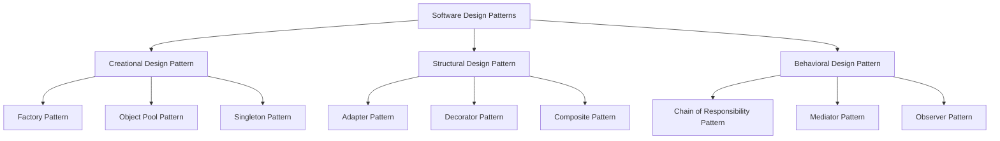

## What are SOLID Principles? What is the difference between SOLID Principles and Design Patterns?

1. SOLID principles are a set of principles, which must be followed to develop flexible, maintainable, and scalable software systems.

A. S -> Single Responsibility Principle
B. O -> Open/ Closed Principle
C. L -> Liskov Substitution Principle
D. I -> Interface Segregation Principle
E. D -> Dependency Inversion Principle

2. SOLID principles aren't concrete - rather abstract.

## Design Patterns

1. Design Patterns are concrete and solve a particular kind of problem in software's.

