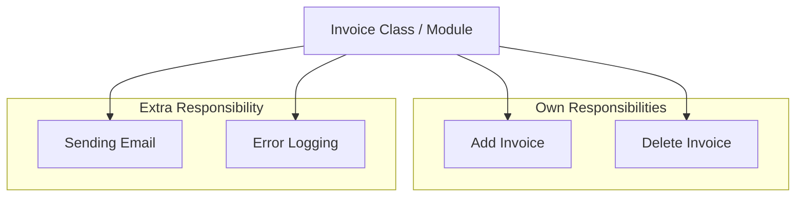

## What is Single Responsibility Principle?

1. Single Responsibility Principle (SRP) states that a class should have only one responsibility.
2. Or a class should have only one reason to change.
3. When a class has only one responsibility, it becomes easier to change and test.If a class has multiple
responsibilities, changing one responsibility may impact others and more testing efforts will be required then.


Below is the example of Violating Single Responsibility Principle, because the class has extra responsibility

```csharp
public class Employee
{
    // Own responsibility
    public int CalculateSalary(){
        return 100000;
    }

    // Own responsibility 
    public string GetDepartment(){
        return "IT";
    }

    // Extra responsibility
    public void Save(){
        // Save employee to the database
    }
}
```

Below is the example which follows Single Responsibility Principle

```csharp
public class Employee{
    public int CalculateSalary(){
        return 100000;
    }

    public string GetDepartment(){
        return "IT";
    }
}

public class EmployeeRepository{
    public void Save(Employee employee){
        // Save employee to the database
    }
}
```

### Another Example 



 Violating the Single Responsibility Principle due to the extra responsibilities
